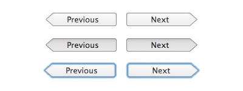

# Arrow Button

Arrow Button is a set of two Cocoa classes containing custom arrow-shaped NSButton subclasses to be used as a replacement for round textured NSButton instances:

For details on how the classes work and what you have to keep in mind, please read my [blog post on this project](http://blog.timschroeder.net/2012/12/27/arrow-buttons/).